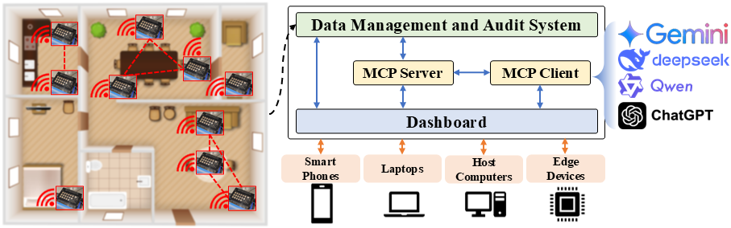

# CIAO
[2025EMNLP] "Where Does This Strange Smell Come from?": Enabling Conversational Interfaces for Artificial Olfaction

<<<<<<< HEAD

## Update

The corpus will be released after November 25, 2025.
=======
# Abstract
We explore the feasibility and usability of a Conversational Interfaces for Artificial Olfaction (CIAO) system using Large Language Models (LLMs) in Smart Home. We made the first olfaction-oriented corpus for LLM evaluation, as well as an olfaction dataset via a self-developed olfactory sensory network.





# Project Structure
- corpus/: the root dir of the corpus
- conversation_examples.json: a multi-round conversation
- info.json: the information used in the MCP server
- mcp_client.py: the script holding a toy client
- mcp_server.py: the script holding a toy server


# Corpus
By substituting the placeholders (```<object_1>```, ```<object_2>```, ```<object>```, ```<position_1>```, ```<position_2>```, and ```<position>```), you could adapt the entire corpus to any scenario. 


# Run CIAO
The open-source CIAO is a toy system using the commercial LLMs.
Before running, please replace ```<YOUR_OPENAI_KEY>``` in ```mcp_client.py``` with your OpenAI key to access the OpenAI service. 

Run the given sample, 
```python
python mcp_client.py 
```

# Requirements

Please ensure the LangChain version you used.

```text 
langchain                    0.3.20
langchain-community          0.3.19
langchain-core               0.3.58
langchain-deepseek           0.1.3
langchain-experimental       0.3.4
langchain-google-genai       2.1.4
langchain-groq               0.3.2
langchain-mcp                0.2.1
langchain-mcp-adapters       0.0.10
langchain-openai             0.3.9
langchain-text-splitters     0.3.6
langcodes                    3.5.0
langgraph                    0.4.1
langgraph-checkpoint         2.0.25
langgraph-prebuilt           0.1.8
langgraph-sdk                0.1.66
langserve                    0.3.1
langsmith                    0.3.8

mcp                          1.7.1

openai                       1.66.3
opencv-python                4.10.0.84
openpyxl                     3.1.5
opentelemetry-api            1.37.0
openTSNE                     1.0.2

```

# Notice
Due to **confidential issues**, we only release the general questions set and a toy MCP program for demonstration.


# If you find this work is interesting, please cite our paper.
```bibtex
@inproceedings{zhou2025does,
  title={“Where Does This Strange Smell Come from?”: Enabling Conversational Interfaces for Artificial Olfaction},
  author={Zhou, Xueyi and Lu, Qi and Chae, Dong-Kyu},
  booktitle={Findings of the Association for Computational Linguistics: EMNLP 2025},
  pages={10719--10745},
  year={2025}
}
```
>>>>>>> origin/master
